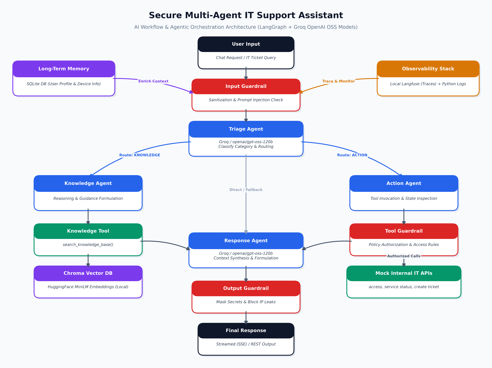
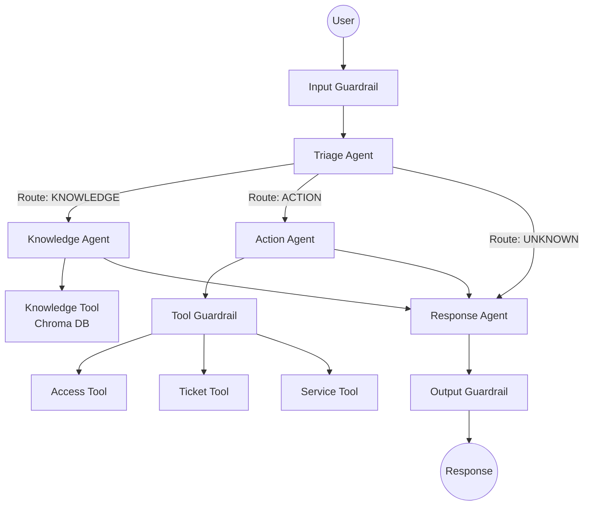

# AI Workflow Architecture

## Interactive Graph

```mermaid
flowchart TD
    USER((User))
    IG[Input Guardrail]
    TA[Triage Agent]
    KA[Knowledge Agent]
    AA[Action Agent]
    RA[Response Agent]
    OG[Output Guardrail]
    
    KT[Knowledge Tool<br>Chroma DB]
    TG[Tool Guardrail]
    AT[Access Tool]
    TT[Ticket Tool]
    ST[Service Tool]
    
    USER --> IG
    IG --> TA
    
    TA -->|Route: KNOWLEDGE| KA
    TA -->|Route: ACTION| AA
    
    KA --> KT
    
    AA --> TG
    TG --> AT
    TG --> TT
    TG --> ST
    
    KA --> RA
    AA --> RA
    TA -->|Route: UNKNOWN| RA
    
    RA --> OG
    OG --> RESPONSE((Response))
```
